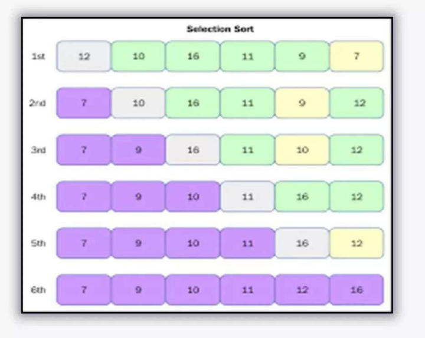

# 13 - Selection sort

- Selection sort is an **in-place** comparison sorting algorithm.

- It has an **O(n^2)** time complexity, which makes it **inefficient** on **large** lists, and generally performs worse than the similar **insertion sort**.

- The algorithm divides the input list into two parts: the **sublist of items already sorted**, which is built up from **left to right** at the **front** (left) of the list, and the **sublist of items remaining to be sorted** that occupy the rest of the list.

### Visual Representation

### Comparison

| Algorithm                                   | Best Case  | Average Case | Worst Case | Space Complexity |
| ------------------------------------------- | ---------- | ------------ | ---------- | ---------------- |
| [Bubble Sort](../12-bubble-sort/README.md)  | O(n)       | O(n^2)       | O(n^2)     | O(1)             |
| [Selection](../13-selection-sort/README.md) | O(n^2)     | O(n^2)       | O(n^2)     | O(1)             |
| [Insertion](../14-insertion-sort/README.md) | O(n)       | O(n^2)       | O(n^2)     | O(1)             |
| [Recursion](../15-recursion/README.md)      | O(n log n) | O(n log n)   | O(n^2)     | O(n)             |
| [Merge](../16-merge-sort/README.md)         | O(n log n) | O(n log n)   | O(n log n) | O(n)             |
| [Quick](../17-quick-sort/README.md)         | O(n log n) | O(n log n)   | O(n^2)     | O(log n)         |

### Materials

* [Java File](./selsort.java)

---

[12 - Bubble sort](../12-bubble-sort/README.md) | **[Home](../README.md)** | [14 - Insertion sort](../14-insertion-sort/README.md)