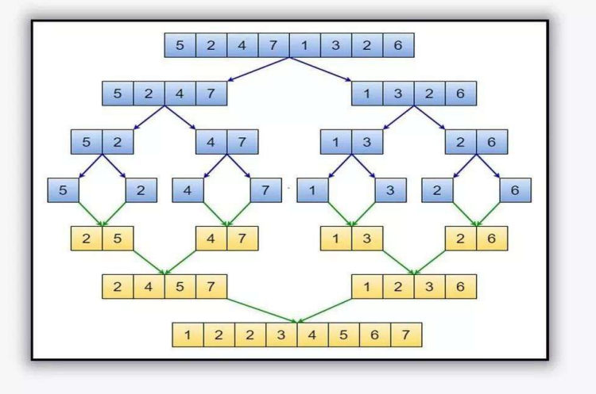

# 16 - Merge sort

- Merge sort is a divide and conquer algorithm.

- It divides the input array into two halves, calls itself for the two halves, and then merges the two sorted halves.

- The merge() function is used for merging two halves.

- `O(n log n)` is the time complexity of merge sort.

### Visual Representation

### Comparison

| Algorithm                                   | Best Case  | Average Case | Worst Case | Space Complexity |
| ------------------------------------------- | ---------- | ------------ | ---------- | ---------------- |
| [Bubble Sort](../12-bubble-sort/README.md)  | O(n)       | O(n^2)       | O(n^2)     | O(1)             |
| [Selection](../13-selection-sort/README.md) | O(n^2)     | O(n^2)       | O(n^2)     | O(1)             |
| [Insertion](../14-insertion-sort/README.md) | O(n)       | O(n^2)       | O(n^2)     | O(1)             |
| [Recursion](../15-recursion/README.md)      | O(n log n) | O(n log n)   | O(n^2)     | O(n)             |
| [Merge](../16-merge-sort/README.md)         | O(n log n) | O(n log n)   | O(n log n) | O(n)             |
| [Quick](../17-quick-sort/README.md)         | O(n log n) | O(n log n)   | O(n^2)     | O(log n)         |

### Materials

* [Java File](./merge.java)

---

[15 - Recursion](../15-recursion/README.md) | **[Home](../README.md)** | [17 - Quick sort](../17-quick-sort/README.md)