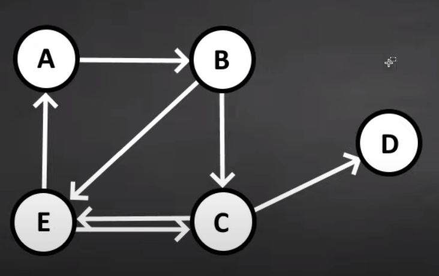
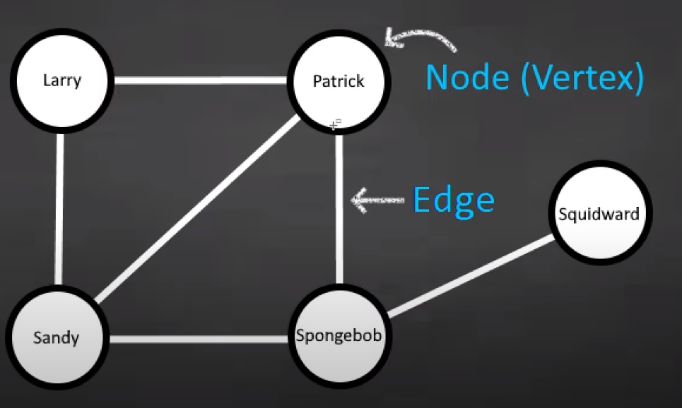

# 19 - Graphs intro

- **Graph** - a collection of vertices and edges

- Used to represent relationships between data

- Types of graphs
  - **Directed** - edges have direction
    - *example* - social network
    - 

  - **Undirected** - edges have no direction
    - *example* - road network
    - 

---

[18 - Hash Tables](../18-hash-table/README.md) | **[Home](../README.md)** | [20 - Adjacency matrix](../20-adj-matrix/README.md)