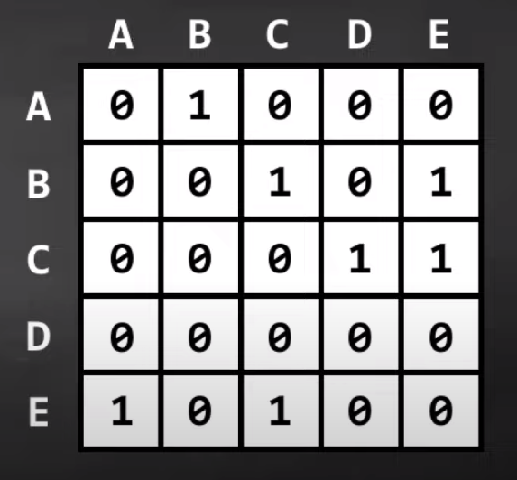

# 20 - Adjacency matrix

- **Adjacency matrix** - a 2D array of vertices where a 1 represents an edge between two vertices

  - 

---

[19 - Graphs intro](../19-graph/README.md) | **[Home](../README.md)** | [21 - Adjacency list](../21-adj-list/README.md)