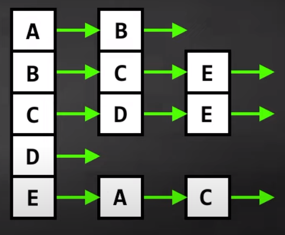

# 21 - Adjacency list

- **Adjacency list** - a list of lists where each list represents a vertex and contains all the vertices it is connected to

- 

---

[20 - Adjacency matrix](../20-adj-matrix/README.md) | **[Home](../README.md)** | [22 - Depth First Search](../22-depth-search/README.md)