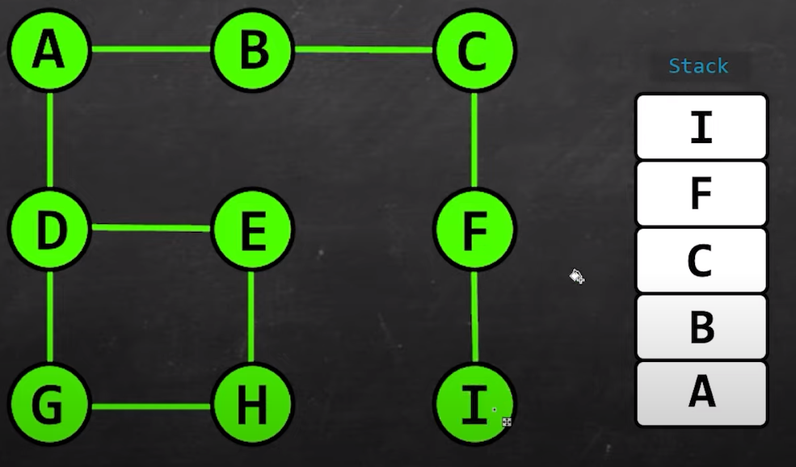

# 22 - Depth First Search

- A **depth first search** (DFS) is a search algorithm for traversing a tree or graph data structure.

- The algorithm starts at the root node (selecting some arbitrary node as the root node in the case of a graph) and explores as far as possible along each branch before backtracking.

- So the basic idea is to **start from the root** or any arbitrary node and mark the node and move to the adjacent unmarked node and **continue** this loop until there is **no** unmarked adjacent node. Then **backtrack** and check for other unmarked nodes and traverse them. 

- Finally print the nodes in the path.

- 

---

[21 - Adjacency list](../21-adj-list/README.md) | **[Home](../README.md)** | [23 - Breadth First Search](../23-breadth-search/README.md)