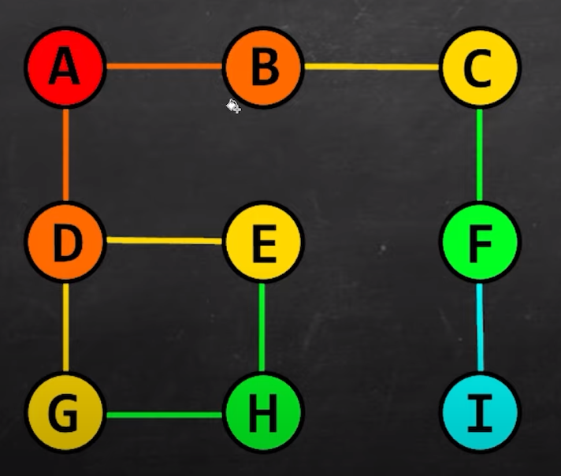

# 23 - Breadth First Search

- **Breadth First Search** is a graph traversal algorithm that **starts** at the **root node** and explores all the **neighbouring nodes**. 

- Then, for each of those nearest **nodes**, it explores their **unexplored neighbour nodes**, and so on, until it finds the **goal**.

- 

---

[22 - Depth First Search](../22-depth-search/README.md) | **[Home](../README.md)** | [24 - Tree data structure intro](../24-tree/README.md)