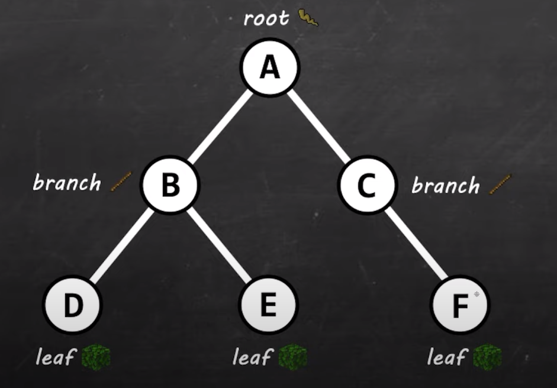
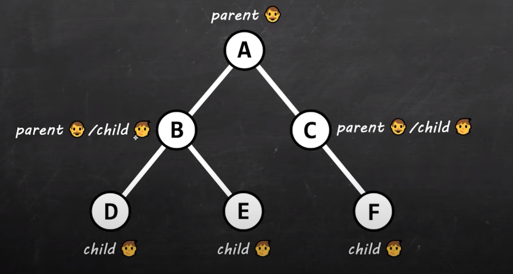
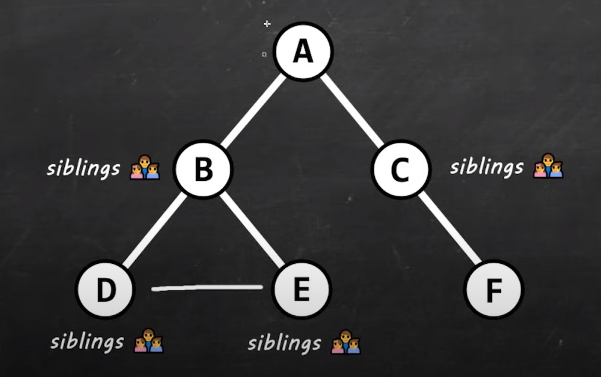

# 24 - Tree data structure intro - Stacks

- A **tree** is a data structure that consists of nodes in a parent / child relationship.

- A tree data structure can be defined recursively (locally) as a collection of nodes (starting at a root node), 
  - where each node is a data structure consisting of a value, 
  - together with a list of references to nodes (the "children"), 
  - with the constraints that no reference is duplicated, and none points to the root.

- *Used in* 
  - File explorer
  - HTML DOM

- *Naming convention*
  - 
  - 
  - 

- *Basics*
  - **Size** of tree is the number of nodes `6`
  - **Depth** of tree is the number of edges from the root to the deepest node `0-1-2` {From A to D}
  - **Height** of tree is the number of edges from the root to the highest node `2-1-0` {From A to D}

---

[23 - Breadth First Search](../23-breadth-search/README.md) | **[Home](../README.md)** | [25 - Binary search tree](../25-binary-search-tree/README.md)