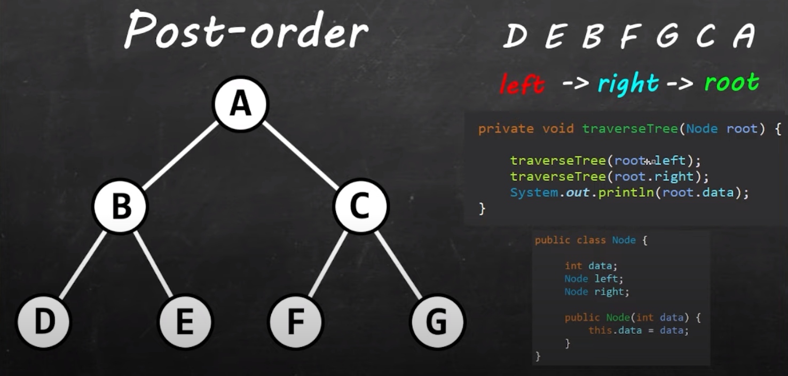

# 26 - Tree traversal

- **Tree traversal** is the process of visiting each node in a tree exactly once. There are three types of tree traversal: **pre-order**, **in-order**, and **post-order**.

  - **Pre-order** traversal 
    - visits the `root node` first, 
    - then the `left` subtree, 
    - and finally the `right` subtree.

      - **used** to create a copy of the tree

    - 

  - **In-order** traversal 
    - visits the `left` subtree first, 
    - then the `root node`, 
    - and finally the `right` subtree.

      - **used** to delete the tree

    - 

  - **Post-order** traversal 
    - visits the `left` subtree first, 
    - then the `right` subtree, 
    - and finally the `root node`.

      - **used** to get nodes of the tree in sorted order

    - 

---

[25 - Binary search tree](../25-binary-search-tree/README.md) | **[Home](../README.md)** | [27 - Calculate execution time](../27-time/README.md)